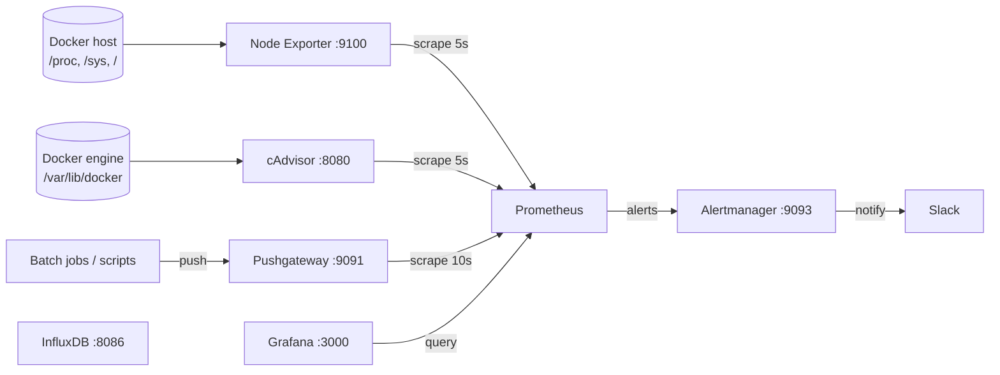
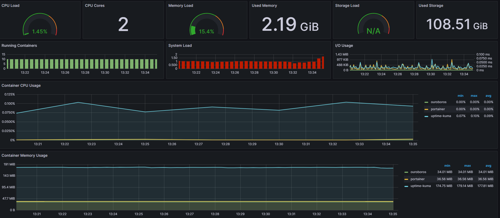
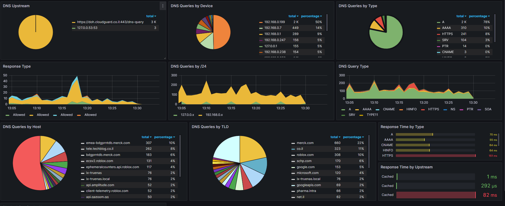
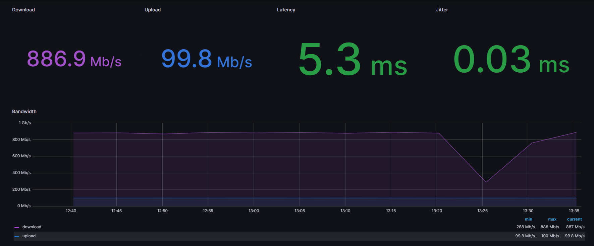

# grafana-stack

A Docker Compose monitoring stack for Docker hosts and containers, built on [Prometheus](https://prometheus.io/), [Grafana](https://grafana.com/), [cAdvisor](https://github.com/google/cadvisor),
[Node Exporter](https://github.com/prometheus/node_exporter), [Pushgateway](https://github.com/prometheus/pushgateway), [InfluxDB](https://www.influxdata.com/) and alerting with [Alertmanager](https://github.com/prometheus/alertmanager).
One `docker compose up` starts the whole stack, with a Prometheus data source and four Grafana dashboards already provisioned.

This repository is based on [stefanprodan/dockprom](https://github.com/stefanprodan/dockprom) (see [Credits](#credits)).

## Table of contents

- [Architecture](#architecture)
- [Services](#services)
- [Requirements](#requirements)
- [Install](#install)
- [Configuration](#configuration)
- [Setup Grafana](#setup-grafana)
- [Dashboards](#dashboards)
- [Screenshots](#screenshots)
- [Define alerts](#define-alerts)
- [Setup alerting](#setup-alerting)
- [Sending metrics to the Pushgateway](#sending-metrics-to-the-pushgateway)
- [Adding scrape targets](#adding-scrape-targets)
- [Security notes](#security-notes)
- [Known issues](#known-issues)
- [Troubleshooting](#troubleshooting)
- [Project layout](#project-layout)
- [Contributing](#contributing)
- [Credits](#credits)
- [License](#license)

## Architecture

All services run on a single bridge network, `monitor-net`, and reach each other by container name.



InfluxDB runs alongside the Prometheus stack, but nothing in this repository writes to it, and it is not configured as a Grafana data source. Add it yourself if you want to use it (for example, as a Grafana data source or as a target for your own collectors).

## Services

| Service | Image | Host port → container port | Purpose |
|---|---|---|---|
| `prometheus` | `prom/prometheus:v2.45.0` | `9090` → `9000` (see [Known issues](#known-issues)) | Metrics database and alert rule evaluation. Retention is `200h`; `--web.enable-lifecycle` is on. |
| `alertmanager` | `prom/alertmanager:v0.25.0` | `9093` → `9093` | Alert routing, grouping and silencing. |
| `grafana` | `grafana/grafana:10.0.1` | `3000` → `3000` | Dashboards (visualize metrics). |
| `influxdb` | `influxdb:1.8.1` | `8086` → `8086` | High-speed time series database. Creates the database `influx` on first start. |
| `pushgateway` | `prom/pushgateway:v1.6.0` | `9091` → `9091` | Push acceptor for ephemeral and batch jobs. |
| `nodeexporter` | `prom/node-exporter:v1.6.0` | `9100` → `9100` | Host metrics collector (CPU, memory, disk, network). |
| `cadvisor` | `gcr.io/cadvisor/cadvisor:v0.47.1` | `8080` → `8080` | Container metrics collector. Runs `privileged`. |

Every service carries the label `org.label-schema.group: "monitoring"`. The dashboards use this label to tell the stack's own containers apart from your workloads.

Persistent data is stored in bind-mounted directories next to the compose file:

| Path on host | Used by |
|---|---|
| `./prometheus_data` | Prometheus TSDB |
| `./grafana/data` | Grafana database (users, settings, dashboards saved in the UI) |
| `./influxdb/data` | InfluxDB data |

## Requirements

* A Linux Docker host (cAdvisor needs `/dev/kmsg`, `/sys` and `/var/lib/docker`).
* Docker Engine 19.03 or later, and Docker Compose v2 (`docker compose`) or docker-compose 1.27 or later. The compose file declares `version: '3.9'`, which Compose v2 ignores.
* Free host ports: `3000`, `8080`, `8086`, `9090`, `9091`, `9093`, `9100`.

## Install

Clone this repository on your Docker host, `cd` into the `grafana-stack` directory and run `compose up`:

```bash
git clone https://github.com/t0mer/grafana-stack
cd grafana-stack

ADMIN_USER='admin' ADMIN_PASSWORD='<choose-a-password>' docker compose up -d
```

(With the older standalone binary, use `docker-compose` instead of `docker compose`.)

Endpoints:

* Prometheus (metrics database) `http://<host-ip>:9090` (see [Known issues](#known-issues))
* Prometheus Pushgateway (push acceptor for ephemeral and batch jobs) `http://<host-ip>:9091`
* Alertmanager (alerts management) `http://<host-ip>:9093` (see [Known issues](#known-issues))
* Grafana (visualize metrics) `http://<host-ip>:3000`
* InfluxDB (high-speed read and write time series database) `http://<host-ip>:8086`
* cAdvisor (container metrics collector) `http://<host-ip>:8080`
* Node Exporter (host metrics collector) `http://<host-ip>:9100/metrics`

## Configuration

### Environment variables

These variables are read by `docker-compose.yml`. Set them in your shell or in a `.env` file next to the compose file.

| Variable | Default | Used by | Description |
|---|---|---|---|
| `ADMIN_USER` | `admin` | Grafana (`GF_SECURITY_ADMIN_USER`) | Grafana admin user name. |
| `ADMIN_PASSWORD` | `admin` | Grafana (`GF_SECURITY_ADMIN_PASSWORD`) | Grafana admin password. **Change it.** |
| `INFLUX_ADMIN_USER` | `admin` | InfluxDB (`INFLUXDB_ADMIN_USER`) | InfluxDB admin user created on first start. |
| `INFLUX_ADMIN_PASSWORD` | `admin` | InfluxDB (`INFLUXDB_ADMIN_PASSWORD`) | InfluxDB admin password. **Change it.** |

Example `.env`:

```bash
ADMIN_USER=admin
ADMIN_PASSWORD=<choose-a-password>
INFLUX_ADMIN_USER=admin
INFLUX_ADMIN_PASSWORD=<choose-a-password>
```

Fixed settings in the compose file:

* Grafana: `GF_USERS_ALLOW_SIGN_UP=false` (self sign-up disabled).
* InfluxDB: `INFLUXDB_DB=influx` (database created on first start).

### Configuration files

| File | What it configures |
|---|---|
| [`prometheus/prometheus.yml`](prometheus/prometheus.yml) | Global scrape/evaluation interval (`15s`), external label `monitor: 'docker-host-alpha'`, scrape jobs, Alertmanager target. |
| [`prometheus/alert.rules`](prometheus/alert.rules) | Prometheus alert rules (see [Define alerts](#define-alerts)). |
| [`alertmanager/config.yml`](alertmanager/config.yml) | Alertmanager route and receivers (a Slack receiver template). |
| [`grafana/provisioning/datasources/datasource.yml`](grafana/provisioning/datasources/datasource.yml) | The default Prometheus data source. |
| [`grafana/provisioning/dashboards/`](grafana/provisioning/dashboards) | Dashboard provider (`dashboard.yml`) and the dashboard JSON files. |
| [`influxdb/influxdb.conf`](influxdb/influxdb.conf) | InfluxDB meta, data and WAL directories. |
| [`config`](config) | Optional Grafana env file (see [Setup Grafana](#setup-grafana)). Not referenced by `docker-compose.yml` by default. |

### Prometheus scrape jobs

| Job | Target | Interval |
|---|---|---|
| `nodeexporter` | `nodeexporter:9100` | 5s |
| `cadvisor` | `cadvisor:8080` | 5s |
| `prometheus` | `localhost:9090` | 10s |
| `pushgateway` | `pushgateway:9091` (`honor_labels: true`) | 10s |

Prometheus sends alerts to `alertmanager:9093`. `prometheus.yml` also contains commented-out example jobs for `nginx` (`nginxexporter:9113`) and `aspnetcore`.

## Setup Grafana

Navigate to `http://<host-ip>:3000` and log in with the user and password set by `ADMIN_USER` and `ADMIN_PASSWORD` (both default to ***admin***). You can change the credentials in the compose file or by supplying the `ADMIN_USER` and `ADMIN_PASSWORD` environment variables on `compose up`.

You can also use an env file. The repository ships one, named `config`, with this format:

```ini
GF_SECURITY_ADMIN_USER=admin
GF_SECURITY_ADMIN_PASSWORD=changeme
GF_USERS_ALLOW_SIGN_UP=false
```

To use it, add it to the `grafana` service:

```yaml
grafana:
  image: grafana/grafana:10.0.1
  env_file:
    - config
```

Values in `environment:` take precedence over `env_file:`, so also remove the matching `GF_*` entries from the service's `environment:` list, otherwise the file has no effect.

The admin credentials are only applied when Grafana creates its database on first start. If you want to change the password later, either change it in the Grafana UI, or reset it from the command line:

```bash
docker exec -it grafana grafana-cli admin reset-admin-password '<new-password>'
```

Alternatively, remove the Grafana data directory (this deletes all Grafana state) so that the environment variables are applied again. It is mounted by this entry:

```yaml
- ./grafana/data:/var/lib/grafana
```

Grafana is preconfigured with dashboards and Prometheus as the default data source:

* Name: Prometheus
* Type: Prometheus
* URL: `http://prometheus:9090`

## Dashboards

The dashboards are provisioned from `grafana/provisioning/dashboards/` into the General folder. They are editable, and changes can be saved from the UI (`allowUiUpdates: true`).

| Dashboard | File | Data needed |
|---|---|---|
| Docker Host | `docker_host.json` | Node Exporter, cAdvisor |
| Docker Containers | `docker_containers.json` | cAdvisor, Node Exporter |
| Monitor Services | `monitor_services.json` | cAdvisor, Node Exporter, Prometheus self-metrics |
| Nginx | `nginx_container.json` | An Nginx exporter scrape job (not enabled by default, see the commented `nginx` job in `prometheus.yml`), cAdvisor and Node Exporter |

***Docker Host Dashboard***

<!-- TODO: screenshot of the provisioned Docker Host dashboard (no matching image in screenshots/) -->

The Docker Host Dashboard shows key metrics for monitoring the resource usage of your server:

* Server uptime, CPU idle percent, number of CPU cores, available memory, swap and storage
* System load average graph, running and blocked by IO processes graph, interrupts graph
* CPU usage graph by mode (guest, idle, iowait, irq, nice, softirq, steal, system, user)
* Memory usage graph by distribution (used, free, buffers, cached)
* IO usage graph (read Bps, write Bps and IO time)
* Network usage graph by device (inbound Bps, outbound Bps)
* Swap usage and activity graphs

For storage and particularly the Free Storage panel, you have to specify the fstype in the Grafana query.
You can find it in `grafana/provisioning/dashboards/docker_host.json`, at line 480:

```json
"expr": "sum(node_filesystem_free_bytes{fstype=\"aufs\"})",
```

The dashboard ships with `aufs`. If your host uses another filesystem, for example BTRFS, change `aufs` to `btrfs`.

You can find the right value for your system in Prometheus by running this query:

```promql
node_filesystem_free_bytes
```

***Docker Containers Dashboard***



The Docker Containers Dashboard shows key metrics for monitoring running containers:

* Total containers CPU load, memory and storage usage
* Running containers graph, system load graph, IO usage graph
* Container CPU usage graph
* Container memory usage graph
* Container cached memory usage graph
* Container network inbound usage graph
* Container network outbound usage graph

Note that this dashboard doesn't show the containers that are part of the monitoring stack (those with the `org.label-schema.group="monitoring"` label).

For storage and particularly the Storage Load panel, you have to specify the fstype in the Grafana query.
You can find it in `grafana/provisioning/dashboards/docker_containers.json`, at line 406:

```json
"expr": "(node_filesystem_size_bytes{fstype=\"aufs\"} - node_filesystem_free_bytes{fstype=\"aufs\"}) / node_filesystem_size_bytes{fstype=\"aufs\"}  * 100",
```

As above, change `aufs` to the filesystem your host uses (for example, `btrfs`).

You can find the right value for your system in Prometheus by running these queries:

```promql
node_filesystem_size_bytes
node_filesystem_free_bytes
```

***Monitor Services Dashboard***


The Monitor Services Dashboard shows key metrics for monitoring the containers that make up the monitoring stack:

* Prometheus uptime, monitoring stack total memory usage, Prometheus in-memory chunks and series
* Container CPU usage graph
* Container memory usage graph
* Prometheus alerts graph (firing alerts by name)
* Prometheus process graphs: file descriptors, memory, allocations
* Prometheus TSDB graphs: head series, active appenders, samples appended, head chunks created and removed, head time range, head GC time, blocks loaded, reloads, problems, WAL latencies, compactions, compaction time, retention cutoffs
* Prometheus target scrapes and scrape duration graphs
* Prometheus HTTP requests, request latency and time spent in HTTP requests
* Query engine timings and rule group evaluation graphs

***Nginx Dashboard***

Shows Nginx requests per second, connections by state, connection rate by stage and the CPU usage of the container named `nginx`. The `nginx_connections_*` metrics it queries come from [discordianfish/nginx_exporter](https://github.com/discordianfish/nginx_exporter); `nginxinc/nginx-prometheus-exporter` exposes different metric names and won't populate it. The dashboard stays empty until you run that exporter and enable a matching scrape job.

## Screenshots

The images in [`screenshots/`](screenshots) come from the author's Grafana instance. Only two of them show dashboards provisioned by this repository:

| Screenshot | Dashboard | Provisioned here? |
|---|---|---|
| [containers.png](screenshots/containers.png) | Docker Containers | Yes |
| [monitored services.png](screenshots/monitored%20services.png) | Monitor Services | Yes |
| [node exporter.png](screenshots/node%20exporter.png) | A Node Exporter dashboard (not the provisioned Docker Host dashboard) | No |
| [adguard.png](screenshots/adguard.png) | AdGuard Home | No |
| [speedtest.png](screenshots/speedtest.png) | Speedtest | No |
| [uptime kuma.png](screenshots/uptime%20kuma.png) | Uptime Kuma | No |

The dashboards that are not provisioned need their own exporters and dashboard JSON, which are not part of this repository.







## Define alerts

Three alert groups have been set up within the [alert.rules](prometheus/alert.rules) configuration file:

* Monitoring services alerts [targets](https://github.com/t0mer/grafana-stack/blob/main/prometheus/alert.rules#L2-L11)
* Docker Host alerts [host](https://github.com/t0mer/grafana-stack/blob/main/prometheus/alert.rules#L13-L40)
* Docker Containers alerts [containers](https://github.com/t0mer/grafana-stack/blob/main/prometheus/alert.rules#L42-L69)

| Group | Alert | Condition | For | Severity |
|---|---|---|---|---|
| `targets` | `monitor_service_down` | `up == 0` (any scrape target down) | 30s | critical |
| `host` | `high_cpu_load` | `node_load1 > 1.5` | 30s | warning |
| `host` | `high_memory_load` | Host memory usage > 85% | 30s | warning |
| `host` | `high_storage_load` | Storage usage > 85% on `fstype="aufs"` | 30s | warning |
| `containers` | `jenkins_down` | No metrics for a container named `jenkins` | 30s | critical |
| `containers` | `jenkins_high_cpu` | `jenkins` container uses > 10% of total CPU | 30s | warning |
| `containers` | `jenkins_high_memory` | `jenkins` container uses > 1.2 GB of RAM | 30s | warning |

The `containers` group is an example written for a container named `jenkins`. If you don't run one, `jenkins_down` fires permanently, so adapt the container name or remove these rules.

You can modify the alert rules and reload them without restarting Prometheus. The lifecycle API is enabled (`--web.enable-lifecycle`), so you can make an HTTP POST call to Prometheus:

```bash
curl -X POST http://<host-ip>:9090/-/reload
```

If the Prometheus port is not reachable from the host (see [Known issues](#known-issues)), send a SIGHUP to the container instead:

```bash
docker kill --signal=HUP prometheus
```

***Monitoring services alerts***

Trigger an alert if any of the monitoring targets (node-exporter, cAdvisor, Prometheus, Pushgateway) is down for more than 30 seconds:

```yaml
- alert: monitor_service_down
  expr: up == 0
  for: 30s
  labels:
    severity: critical
  annotations:
    summary: "Monitor service non-operational"
    description: "Service {{ $labels.instance }} is down."
```

***Docker Host alerts***

Trigger an alert if the Docker host CPU is under high load for more than 30 seconds:

```yaml
- alert: high_cpu_load
  expr: node_load1 > 1.5
  for: 30s
  labels:
    severity: warning
  annotations:
    summary: "Server under high load"
    description: "Docker host is under high load, the avg load 1m is at {{ $value}}. Reported by instance {{ $labels.instance }} of job {{ $labels.job }}."
```

Modify the load threshold based on your CPU cores.

Trigger an alert if the Docker host memory is almost full:

```yaml
- alert: high_memory_load
  expr: (sum(node_memory_MemTotal_bytes) - sum(node_memory_MemFree_bytes + node_memory_Buffers_bytes + node_memory_Cached_bytes) ) / sum(node_memory_MemTotal_bytes) * 100 > 85
  for: 30s
  labels:
    severity: warning
  annotations:
    summary: "Server memory is almost full"
    description: "Docker host memory usage is {{ humanize $value}}%. Reported by instance {{ $labels.instance }} of job {{ $labels.job }}."
```

Trigger an alert if the Docker host storage is almost full (change `aufs` to your filesystem type, as for the dashboards):

```yaml
- alert: high_storage_load
  expr: (node_filesystem_size_bytes{fstype="aufs"} - node_filesystem_free_bytes{fstype="aufs"}) / node_filesystem_size_bytes{fstype="aufs"}  * 100 > 85
  for: 30s
  labels:
    severity: warning
  annotations:
    summary: "Server storage is almost full"
    description: "Docker host storage usage is {{ humanize $value}}%. Reported by instance {{ $labels.instance }} of job {{ $labels.job }}."
```

***Docker Containers alerts***

Trigger an alert if a container is down for more than 30 seconds:

```yaml
- alert: jenkins_down
  expr: absent(container_memory_usage_bytes{name="jenkins"})
  for: 30s
  labels:
    severity: critical
  annotations:
    summary: "Jenkins down"
    description: "Jenkins container is down for more than 30 seconds."
```

Trigger an alert if a container is using more than 10% of total CPU cores for more than 30 seconds:

```yaml
- alert: jenkins_high_cpu
  expr: sum(rate(container_cpu_usage_seconds_total{name="jenkins"}[1m])) / count(node_cpu_seconds_total{mode="system"}) * 100 > 10
  for: 30s
  labels:
    severity: warning
  annotations:
    summary: "Jenkins high CPU usage"
    description: "Jenkins CPU usage is {{ humanize $value}}%."
```

Trigger an alert if a container is using more than 1.2 GB of RAM for more than 30 seconds:

```yaml
- alert: jenkins_high_memory
  expr: sum(container_memory_usage_bytes{name="jenkins"}) > 1200000000
  for: 30s
  labels:
    severity: warning
  annotations:
    summary: "Jenkins high memory usage"
    description: "Jenkins memory consumption is at {{ humanize $value}}."
```

## Setup alerting

The Alertmanager service is responsible for handling alerts sent by the Prometheus server.
Alertmanager can send notifications via email, Pushover, Slack, Telegram, Microsoft Teams, PagerDuty, Opsgenie or any other system that exposes a webhook interface.
A complete list of integrations can be found [here](https://prometheus.io/docs/alerting/latest/configuration/).

You can view and silence notifications by accessing `http://<host-ip>:9093`.

The notification receivers can be configured in the [alertmanager/config.yml](alertmanager/config.yml) file. Before alerting works, check the Alertmanager volume mount described in [Known issues](#known-issues).

To receive alerts via Slack, create an ***Incoming Webhook*** for your Slack workspace.
You can find more details on setting up the Slack integration [here](https://www.robustperception.io/using-slack-with-the-alertmanager/).

Copy the Slack Webhook URL into the ***api_url*** field and specify a Slack ***channel***. The shipped file contains placeholders that you must replace:

```yaml
route:
    receiver: 'slack'

receivers:
    - name: 'slack'
      slack_configs:
          - send_resolved: true
            text: "{{ .CommonAnnotations.description }}"
            username: 'Prometheus'
            channel: '#<channel-name>'
            api_url: 'https://hooks.slack.com/services/<webhook-id>'
```

## Sending metrics to the Pushgateway

The [Pushgateway](https://github.com/prometheus/pushgateway) is used to collect data from batch jobs or from services.

To push data, simply execute:

```bash
echo "some_metric 3.14" | curl --data-binary @- http://<host-ip>:9091/metrics/job/some_job
```

The Pushgateway has no authentication in this stack. Prometheus scrapes it every 10 seconds with `honor_labels: true`, so the `job` and `instance` labels you push are kept.

## Adding scrape targets

Add a job to the `scrape_configs` section of [`prometheus/prometheus.yml`](prometheus/prometheus.yml). Targets on the `monitor-net` network can be addressed by container name:

```yaml
  - job_name: 'nginx'
    scrape_interval: 10s
    static_configs:
      - targets: ['nginxexporter:9113']
```

Then reload Prometheus as described in [Define alerts](#define-alerts). To scrape another container by name, attach it to the `monitor-net` network (Compose names it `<project>_monitor-net`, for example `grafana-stack_monitor-net`).

## Security notes

* **Change the default credentials.** Grafana and InfluxDB fall back to `admin` / `admin` when `ADMIN_PASSWORD` / `INFLUX_ADMIN_PASSWORD` are not set.
* **Most services have no authentication.** Prometheus, Alertmanager, Pushgateway, cAdvisor and Node Exporter are published on all host interfaces without a login. `influxdb.conf` does not enable HTTP authentication. Anyone who can reach these ports can read metrics, push metrics, silence alerts, or (through the lifecycle API) reload or shut down Prometheus. Restrict the ports with a firewall, bind them to `127.0.0.1`, or put a reverse proxy with authentication in front of them.
* **Host access.** cAdvisor runs `privileged` and mounts `/`, `/var/run` (which includes the Docker socket), `/sys` and `/var/lib/docker` read-only. Node Exporter mounts `/proc`, `/sys` and `/` read-only. Only run the stack on hosts where that is acceptable.
* **Secrets in files.** Don't commit a real Slack webhook URL in `alertmanager/config.yml`, or real passwords in `config` or `.env`.

## Known issues

These come from the current `docker-compose.yml` and configuration files:

* **Prometheus port mapping.** The compose file maps host port `9090` to container port `9000`, but Prometheus listens on `9090`, so `http://<host-ip>:9090` does not reach Prometheus. Grafana is not affected, because it connects to `http://prometheus:9090` on the internal network. Nothing sets `--web.listen-address`, so nothing listens on container port `9000`. To expose the Prometheus UI, change the mapping to `9090:9090`.
* **Alertmanager fails to start.** Alertmanager is started with `--config.file=/etc/alertmanager/config.yml`, but nothing is mounted at `/etc/alertmanager`: the compose file mounts `./prometheus/config` (which does not exist in the repository) to `/etc/prometheus`, and never mounts `./alertmanager/config.yml`. The image only ships `/etc/alertmanager/alertmanager.yml`, so Alertmanager exits at startup and restarts in a loop (`restart: unless-stopped`), and the UI on port `9093` is unavailable. The `./prometheus/data` → `/prometheus` mount is unused, and `--storage.path=/alertmanager` is not persisted. A fix is to mount `./alertmanager:/etc/alertmanager` (and a data directory at `/alertmanager` if you want silences to survive restarts).
* **Storage panels and alert use `aufs`.** Modern Docker hosts usually report `ext4`, `xfs` or `btrfs`, so the Storage Load / Free Storage panels and the `high_storage_load` alert stay empty until you change the fstype.

## Troubleshooting

**Grafana or Prometheus can't write to their data directory.** The data directories are bind mounts. Grafana runs as user ID `472`, and Prometheus runs as `nobody` (`65534`). If Docker creates the directories as root, fix the ownership and restart the stack:

```bash
sudo chown -R 472:472 ./grafana/data
sudo chown -R 65534:65534 ./prometheus_data
docker compose up -d
```

**Upgrading from Grafana older than 5.1.** In Grafana versions >= 5.1 the ID of the grafana user changed; the official image now runs as UID 472. Files created before 5.1 won't have the correct permissions for later versions:

| Version |   User  | User ID |
|:-------:|:-------:|:-------:|
|  < 5.1  | grafana |   104   |
|  \>= 5.1 | grafana |   472   |

There are two possible solutions to this problem:

1. Change the ownership from 104 to 472 (as shown above).
2. Start the upgraded container as user 104 by adding `user: "104"` to the `grafana` service in `docker-compose.yml`.

**The admin password doesn't change.** See [Setup Grafana](#setup-grafana): the environment variables are only applied on the first start.

**Dashboards show "N/A" for storage.** See the fstype notes in [Dashboards](#dashboards).

## Project layout

```
.
├── docker-compose.yml          # all services
├── config                      # optional Grafana env file
├── alertmanager/config.yml     # Alertmanager route and receivers
├── prometheus/
│   ├── prometheus.yml          # scrape jobs, Alertmanager target
│   └── alert.rules             # alert rules
├── grafana/provisioning/
│   ├── datasources/datasource.yml
│   └── dashboards/             # dashboard.yml + dashboard JSON files
├── influxdb/influxdb.conf
└── screenshots/
```

## Contributing

Issues and pull requests are welcome. Please keep changes to the compose file, Prometheus configuration and dashboards in separate pull requests, and describe how you tested them.

## Credits

This stack is derived from [dockprom](https://github.com/stefanprodan/dockprom) by Stefan Prodan, released under the MIT License. The Docker Host, Docker Containers, Monitor Services and Nginx dashboards, the alert rules and much of this README come from that project.

## License

This project is licensed under the MIT License. See [LICENSE](LICENSE) (Copyright (c) 2016 Stefan Prodan).
